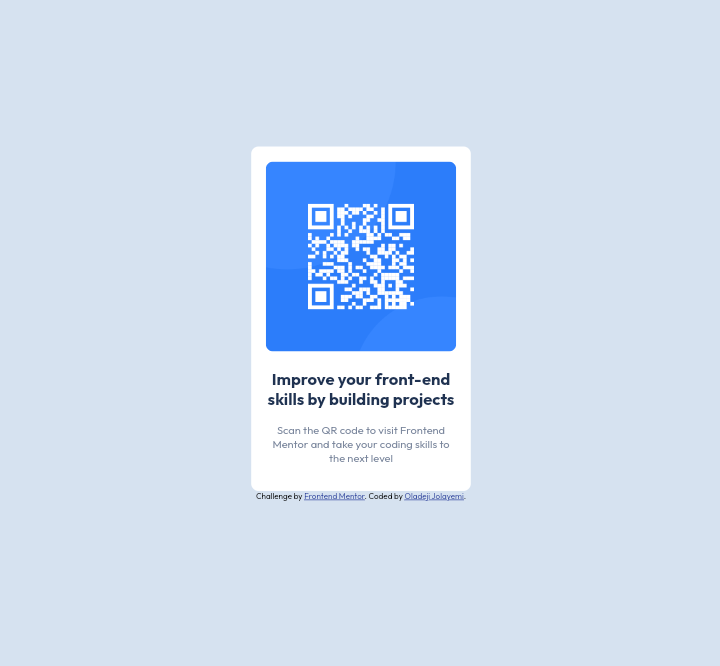

# Frontend Mentor - QR code component solution

This is a solution to the [QR code component challenge on Frontend Mentor](https://www.frontendmentor.io/challenges/qr-code-component-iux_sIO_H). Frontend Mentor challenges help you improve your coding skills by building realistic projects. 

## Overview

### Screenshot
146

### Links

- Solution URL: (https://github.com/Jolayemz/qr-code-component-main.git)
- Live Site URL: (https://jolayemz.github.io/qr-code-component-main/)

### Built with

- Semantic HTML5 markup
- CSS custom properties
- CSS Grid
- Mobile-first workflow

### Continued development

I want to continue taking challenges from front-end mentor to have a solid foundation in both html, css and JavaScript.
Use this section to outline areas that you want to continue focusing on in future projects. These could be concepts you're still not completely comfortable with or techniques you found useful that you want to refine and perfect.

## Author

- Website - [Oladeji Jolayemi Israel]
- Frontend Mentor - [@jolayemz](https://www.frontendmentor.io/profile/jolayemz)
- Twitter - [@jolayemz](https://www.twitter.com/jolayemz)
